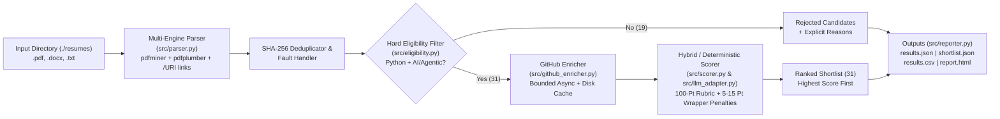

# AI Resume Screening & Ranking System

A production-minded, fault-tolerant backend pipeline that ingests a folder of resumes (`.pdf`, `.docx`, `.txt`), enforces deterministic hard eligibility rules for an **SDE Intern (Python + AI/Agentic Systems)** role, enriches eligible profiles with public **GitHub activity**, scores and ranks candidates on an explainable **100-point rubric** (with explicit **5–15 point project-quality penalties** for shallow LLM API wrappers), and outputs structured `JSON`, `CSV`, and `HTML` reports via both a **CLI** and a **FastAPI REST API**.

---

## Table of Contents
1. [System Architecture](#system-architecture)
2. [Quick Start & Run Instructions](#quick-start--run-instructions)
3. [Generated Outputs & 50-Resume Batch Results](#generated-outputs--50-resume-batch-results)
4. [Project Structure](#project-structure)
5. [Design Decisions](#design-decisions)
   - [1. Multi-Engine Layout-Aware Parsing & PDF Hyperlink Extraction](#1-multi-engine-layout-aware-parsing--pdf-hyperlink-extraction)
   - [2. Filtering Strategy (Hard Eligibility Rules)](#2-filtering-strategy-hard-eligibility-rules)
   - [3. Scoring Strategy & Project-Quality Penalties (100-Point Rubric)](#3-scoring-strategy--project-quality-penalties-100-point-rubric)
   - [4. LLM Usage & Hybrid Resilience](#4-llm-usage--hybrid-resilience)
   - [5. GitHub Enrichment & Scoring](#5-github-enrichment--scoring)
6. [If I Had More Time](#if-i-had-more-time)

---

## System Architecture



---

## Quick Start & Run Instructions

### 1. Environment Setup

```bash
# Optional: create and activate a virtual environment
python -m venv .venv
# Windows PowerShell:
.venv\Scripts\Activate.ps1
# Linux / macOS:
source .venv/bin/activate

# Install dependencies
pip install -r requirements.txt

# Optional: configure environment variables (.env)
cp .env.example .env
```

> **Note on API Keys**: All API keys (`GROQ_API_KEY`, `OPENAI_API_KEY`, `GEMINI_API_KEY`, `GITHUB_TOKEN`) are optional and read strictly from environment variables / `.env`. If no LLM API key is configured, or if `--no-llm` is passed, the pipeline runs seamlessly in deterministic evidence-backed semantic mode.

### 2. Run the Screening Pipeline (CLI)

```bash
# Standard batch run (processes ./resumes and generates ./output/results.json, shortlist.json, results.csv, report.html)
python main.py --input ./resumes --output ./output/results.json

# Run in purely deterministic mode (no external LLM calls)
python main.py --input ./resumes --output ./output/results.json --no-llm

# Run without live GitHub API calls (offline / instant mode)
python main.py --input ./resumes --output ./output/results.json --no-github

# Run with custom concurrency and custom CSV/HTML paths
python main.py --input ./resumes --output ./output/results.json --concurrency 5 --csv ./output/results.csv --html ./output/report.html
```

### 3. Run the FastAPI Server (Optional REST API Interface)

```bash
# Start FastAPI server on http://localhost:8000
python main.py --serve --port 8000

# Health check
curl http://localhost:8000/health

# Trigger screening batch via REST API
curl -X POST http://localhost:8000/screen -H "Content-Type: application/json" -d "{\"input_dir\": \"./resumes\", \"output_path\": \"./output/results.json\"}"

# Retrieve full screening report or ranked shortlist array
curl http://localhost:8000/results
curl http://localhost:8000/shortlist
```

### 4. Run Unit & Integration Tests

```bash
python -m pytest -v
```

---

## Generated Outputs & 50-Resume Batch Results

Running `python main.py --input ./resumes --output ./output/results.json` produces four artifacts in `./output/`:

1. **`output/results.json`** — Complete machine-readable screening report containing:
   - `batch_summary`: total resumes (`50`), successfully parsed (`50`), duplicates (`0`), eligible (`31`), rejected (`19`), failed/unreadable (`0`), GitHub enriched count (`29`), and evaluation mode (`hybrid (groq + deterministic)`).
   - `ranked_candidates`: all 31 eligible candidates ranked highest score first (`rank: 1..31`) with `score_breakdown`, `matched_skills`, `project_summary`, `github_summary`, `strengths`, `concerns`, `penalty_applied`, and `score_evidence`.
   - `rejected_candidates`: all 19 rejected candidates with explicit `rejection_reasons` and `matched_skills`.
   - `failed_resumes`: any malformed or unreadable files encountered during ingestion.
2. **`output/shortlist.json`** — Top-level JSON array (`[ { "rank": 1, "candidate_name": ..., ... } ]`) matching the exact schema snippet in Section 7 of the assignment specification.
3. **`output/results.csv`** — Tabular CSV export of all 50 screened candidates and their category breakdowns.
4. **`output/report.html`** — Self-contained visual HTML dashboard of ranked and rejected candidates.

### Top 10 Ranked Candidates (`output/results.json`)

| Rank | Candidate | File | Total Score | AI Depth (40) | Python/BE (30) | Cloud/FS (15) | GitHub (10) | Eng Depth (5) | Penalty |
| :---: | :--- | :--- | :---: | :---: | :---: | :---: | :---: | :---: | :---: |
| **1** | **Yash Maini** | `candidate_13.pdf` | **92** | 38 | 28 | 12 | 10 | 4 | 0 |
| **2** | **Prathamesh Patil** | `candidate_35.pdf` | **90** | 34 | 29 | 14 | 8 | 5 | 0 |
| **3** | **V Sree Raghu Vardhan** | `candidate_30.pdf` | **87** | 33 | 28 | 14 | 8 | 4 | 0 |
| **4** | **PRAJWAL A S** | `candidate_42.pdf` | **84** | 39 | 26 | 7 | 9 | 3 | 0 |
| **5** | **Noman Khan** | `candidate_27.pdf` | **83** | 34 | 24 | 13 | 9 | 3 | 0 |
| **6** | **ADITYA VERMA** | `candidate_21.pdf` | **83** | 34 | 25 | 12 | 8 | 4 | 0 |
| **7** | **Md Taufique** | `candidate_48.pdf` | **82** | 36 | 24 | 11 | 8 | 3 | 0 |
| **8** | **SHASHWAT MISHRA** | `candidate_10.pdf` | **82** | 37 | 22 | 9 | 10 | 4 | 0 |
| **9** | **Devansh Rajani** | `candidate_47.pdf` | **82** | 34 | 24 | 12 | 8 | 4 | 0 |
| **10** | **Ashish Kumar** | `candidate_41.pdf` | **81** | 33 | 26 | 10 | 8 | 4 | 0 |

### Sample Penalized Eligible Candidates (Thin API Wrappers / Shallow POCs)

| Rank | Candidate | File | Total Score | AI Depth (40) | Penalty Applied | Reason for Penalty |
| :---: | :--- | :--- | :---: | :---: | :---: | :--- |
| **26** | **Thejeshwaar Paasila** | `candidate_26.pdf` | **58** | 15 | **-10 pts** | Thin LLM API wrapper (`OpenAI`/`Gemini` calls without vector retrieval or agent state) |
| **27** | **HARSHA A** | `candidate_15.pdf` | **58** | 12 | **-8 pts** | Vector search (`pgvector`) used solely for CV face embeddings rather than LLM/RAG/agentic workflows |
| **29** | **ANUSHA VERMA** | `candidate_38.pdf` | **56** | 11 | **-10 pts** | Thin wrapper around Gemini API without retrieval, vector DB, or agent orchestration |
| **30** | **Rishabh Kumar** | `candidate_25.pdf` | **47** | 11 | **-10 pts** | Basic Gemini API integration without RAG or multi-step agent architecture |
| **31** | **Manmohan** | `candidate_06.pdf` | **29** | 9 | **-10 pts** | Basic LLaMA/Mistral API call without vector retrieval or agent state |

---

## Project Structure

```text
├── main.py                  # CLI entrypoint (--input, --output, --csv, --html, --serve)
├── PLAN.md                  # System architecture and implementation plan
├── README.md                # Setup, usage, Design Decisions, and If I Had More Time
├── requirements.txt         # Pinned Python dependencies
├── pytest.ini               # Pytest configuration
├── .env.example             # Environment variable template (no real secrets)
├── .gitignore               # Excludes .env, .cache/, __pycache__/, and virtualenvs
├── resumes/                 # Input dataset of 50 candidate resumes (candidate_01.pdf .. candidate_50.pdf)
├── output/                  # Generated outputs for the 50-resume dataset
│   ├── results.json         # Complete batch summary + ranked eligible + rejected candidates
│   ├── shortlist.json       # Ranked shortlist array matching Section 7 specification
│   ├── results.csv          # Tabular CSV export of all 50 candidates
│   └── report.html          # Visual HTML dashboard report
├── src/
│   ├── __init__.py
│   ├── config.py            # Centralized weights (40/30/15/10/5), thresholds, env vars, skill patterns
│   ├── models.py            # Pydantic v2 schemas for parsing, eligibility, LLM, GitHub, and output
│   ├── parser.py            # Dual-engine PDF/DOCX/TXT parser + PDF /URI hyperlink & font-size extractor
│   ├── eligibility.py       # Deterministic rule-based hard eligibility filter
│   ├── github_enricher.py   # Async bounded-concurrency GitHub API client + disk cache + 10-pt scorer
│   ├── llm_adapter.py       # Provider-agnostic LLM structured output adapter (Groq/OpenAI/Gemini + fallback)
│   ├── scorer.py            # 100-point scoring engine with thin API-wrapper penalties (5–15 pts)
│   ├── pipeline.py          # End-to-end batch orchestrator with SHA-256 file deduplication
│   ├── reporter.py          # JSON, CSV, HTML, and terminal table generators
│   └── api.py               # FastAPI server (POST /screen, GET /results, GET /shortlist, GET /health)
└── tests/
    └── test_pipeline.py     # 17 unit & integration tests covering all core modules and edge cases
```

---

## Design Decisions

### 1. Multi-Engine Layout-Aware Parsing & PDF Hyperlink Extraction
Real-world resumes vary widely in layout (single-column, two-column, missing font bounding boxes, contact headers above names):
- **Dual PDF Extraction (`pdfminer.six` + `pdfplumber`)**: `pdfminer.six` (`LAParams`) groups multi-column text into vertical blocks so two-column resumes (e.g., `candidate_15.pdf`, `candidate_23.pdf`) do not interleave horizontally. When a PDF lacks valid `FontBBox` descriptors (e.g., `candidate_20.pdf`), the parser automatically falls back to `pdfplumber` line extraction.
- **Embedded Hyperlink (`/URI`) Extraction**: In 29 out of 50 provided resumes, the candidate's GitHub URL is not written in visible text—it is embedded behind a `"GitHub"` link annotation. Extracting `page.hyperlinks` (and scanning raw PDF `/URI` objects) recovers **44/50** GitHub profiles instead of only 15/50 from plain text.
- **Font-Size Name Detection**: Using Page 1 character font sizes (`extract_words(extra_attrs=['size'])`), the parser reliably extracts candidate names even when emails, phone numbers, or locations appear on the first line (e.g., `candidate_09.pdf`, `candidate_17.pdf`, `candidate_32.pdf`, `candidate_35.pdf`, `candidate_36.pdf`, `candidate_37.pdf`, `candidate_44.pdf`).
- **Multi-Line Bullet Reconstruction**: `_reconstruct_bullets_from_lines` merges PDF-wrapped continuation lines, rejoins hyphenated line wraps (`Plat-\nform` -> `Platform`), and filters out right-margin date/CGPA/location fragments so extracted project summaries and work-text evidence are always grammatically complete.

### 2. Filtering Strategy (Hard Eligibility Rules)
Eligibility is enforced deterministically outside the LLM (`src/eligibility.py`) before any ranking or external API calls occur. A candidate is eligible **only** when both conditions hold:
1. **Genuine Python Evidence**: Python must appear in projects, work experience, or alongside Python ecosystem frameworks/libraries (`FastAPI`, `Django`, `Flask`, `PyTorch`, `TensorFlow`, `Scikit-learn`, `Asyncio`, `Pydantic`, `Docling`, `Haystack`). Profiles that only list `"Python"` once in a generic language list while 100% of their backend stack and projects are Java/Spring Boot (`candidate_09.pdf`, `candidate_31.pdf`) or Node.js/TypeScript (`candidate_11.pdf`, `candidate_32.pdf`) are rejected with `"No evidence of Python stack"`.
2. **Meaningful AI / Agentic / RAG Evidence**: Requires concrete evidence of agentic frameworks (`LangChain`, `LangGraph`, `LlamaIndex`, `Google ADK`, `CrewAI`, `AutoGen`, `LiveKit Agents`, `Claude Agent SDK`, `MCP`), RAG pipelines, vector search (`pgvector`, `Qdrant`, `Pinecone`, `ChromaDB`, `FAISS`, `Weaviate`, `Milvus`), or LLM application pipelines.
   - **False-Positive Guardrails**: Mentioning AI coding assistants (`Claude Code`, `Claude AI`, `Cursor`, `GitHub Copilot`) as IDE/developer tools (`candidate_34.pdf`, `candidate_45.pdf`) or mentioning generic database/file `"data retrieval"` (`candidate_31.pdf`, `candidate_46.pdf`) does **not** pass the AI/agentic filter.
   - **Multi-Stack Tolerance**: Candidates who satisfy Python + AI are never penalized for also knowing Java, JavaScript, React, or Next.js.

### 3. Scoring Strategy & Project-Quality Penalties (100-Point Rubric)
Eligible candidates are scored across five weighted categories (`src/scorer.py`):
- **AI / Agentic / RAG Project Depth (40 pts)**: Rewards applied evidence in `projects` and `experience` sections—stateful agent orchestration (`LangGraph`, multi-agent systems, tool calling, `MCP`), RAG with vector databases (`pgvector`, `Qdrant`, `Pinecone`, `Milvus`, `Weaviate`, `ChromaDB`), advanced ingestion/reranking (`Docling`, `LlamaParse`, `GraphRAG`), and production evaluation/guardrails (`LLM-as-a-judge`, `Agent QA`, `Pydantic` validation, `Ollama`/`vLLM` self-hosted inference).
  - **Explicit Project-Quality Penalties (5–15 pts deducted)**:
    - **Thin API-Wrapper Penalty (-10 pts)**: Deducted when an AI project is merely a thin Streamlit/Flask/REST wrapper around `OpenAI`/`Gemini`/`Groq`/`LLaMA` API calls without vector retrieval, agent state, tool calling, or evaluation (`candidate_06.pdf`, `candidate_25.pdf`, `candidate_26.pdf`, `candidate_29.pdf`, `candidate_38.pdf`).
    - **CV-Only Vector / Shallow POC Penalty (-6 to -8 pts)**: Deducted when vector search is used solely for classical computer vision embeddings without LLM/RAG/agentic workflows (`candidate_15.pdf`, `-8 pts`) or when project descriptions lack vector DB, tool-calling, or evaluation depth (`candidate_23.pdf`, `candidate_24.pdf`, `candidate_36.pdf`, `candidate_49.pdf`, `-6 pts`).
    - **Skills-Only Discount**: Keywords appearing only in the `Skills` section without project/internship evidence receive less than half the credit of applied implementations.
- **Python & Backend Engineering (30 pts)**: Rewards applied Python depth (up to 10 pts), `FastAPI` (up to 8 pts; `Django`/`Flask` partial credit), `async`/`asyncio`/streaming/WebSockets (up to 4 pts), `PostgreSQL` (up to 5 pts), and `Redis` (up to 3 pts).
- **Cloud / Deployment / Full Stack (15 pts)**: Rewards `GCP` (`Google Cloud`, `Vertex AI`), `AWS`/`Azure`, `Docker`, `Kubernetes`, `CI/CD` (`GitHub Actions`, `Jenkins`), and `React`/`Next.js`/`TypeScript` end-to-end integration.
- **GitHub Activity (10 pts)**: Enriched from public GitHub repositories (`0–5 pts` recent push activity + `0–5 pts` maintained & Python/AI-relevant repositories).
- **Engineering Depth Signals (5 pts)**: 1 point each for automated testing (`pytest`, Playwright, benchmarks), system architecture (`microservices`, `multi-tenant`, `RBAC`), caching/latency optimization, message queues (`Kafka`, `Celery`, `BullMQ`), and observability/resilience (`Grafana`, `Prometheus`, `Loki`, circuit breakers, retries, idempotency).

### 4. LLM Usage & Hybrid Resilience
- **Provider-Agnostic Structured Output (`src/llm_adapter.py`)**: Wraps `Groq`, `OpenAI`, and `Gemini` behind `LLMProviderAdapter`, enforcing a strict Pydantic v2 output schema (`LLMResumeEvaluation`) and caching responses by file SHA-256 hash in `.cache/llm_cache.json`.
- **Multi-Model Fallback & Rate-Limit Resilience**: When using Groq, the adapter automatically falls back across models (`openai/gpt-oss-120b` -> `openai/gpt-oss-20b` -> `qwen/qwen3.8-27b` -> `llama-3.3-70b-versatile`) with `Retry-After` backoff if a model hits token rate limits or returns malformed JSON.
- **60/40 Hybrid Blending & Deterministic Fallback**: When LLM evaluation is active, category scores blend 60% LLM structured evaluation with 40% deterministic evidence scoring while enforcing the deterministic wrapper penalty floor. If no API key is configured or an API call fails for a resume, the pipeline falls back seamlessly to deterministic scoring so a batch never fails.

### 5. GitHub Enrichment & Scoring
- **Rate-Limit-Safe Single-Endpoint Query**: Unauthenticated GitHub REST API requests are limited to **60 requests/hour**. Instead of making 3–4 requests per candidate, `GitHubEnricher` queries `GET /users/{username}/repos?sort=pushed&per_page=100` (**1 API call per unique eligible candidate**), which simultaneously verifies profile existence, returns up to 100 public repositories sorted by most recent push (`pushed_at`), and provides `fork` status, `language`, `description`, and `topics`.
- **Explainable 10-Point Formula**:
  - **Recent Activity (`0–5 pts`)**: `5 pts` if pushed within 30 days (or $\ge 3$ repos pushed within 90 days), `4 pts` within 90 days, `3 pts` within 180 days, `2 pts` within 365 days, `1 pt` if older.
  - **Maintained & Relevant Repos (`0–5 pts`)**: Up to `2 pts` for non-fork maintained repository count ($\ge 8$ repos = 2 pts; $\ge 3$ repos = 1 pt) + up to `3 pts` for Python/AI-relevant repositories ($\ge 4$ repos = 3 pts; $\ge 2$ repos = 2 pts; $\ge 1$ repo = 1 pt).
- **Graceful Degradation & Caching**: Missing profiles, 404s, or rate limits never fail the batch and are recorded transparently in `github_status` and `github_summary`. Responses are cached in `.cache/github_cache.json`.

---

## If I Had More Time

1. **Citation-Level Evidence Span Linking**: Attach exact line/character offsets and PDF bounding-box coordinates to every extracted skill and project claim so reviewers can hover over a score in `report.html` and highlight the exact bullet in the original PDF.
2. **GitHub Commit & README Deep Inspection via GraphQL**: When a `GITHUB_TOKEN` is available, use the GitHub GraphQL API to fetch the candidate's actual commit contributions over the past 90 days and inspect the `README.md` / `pyproject.toml` of their pinned AI repositories to verify code ownership vs. forked tutorials.
3. **OCR Fallback for Scanned Image PDFs**: Integrate lightweight OCR (`pypdfium2` + `rapidocr` / `tesseract`) only when both `pdfminer` and `pdfplumber` extract fewer than 20 characters from a page.
4. **Calibration Benchmark & Pairwise Reranking**: Add a golden evaluation set of 10 human-labeled resumes with Spearman rank-correlation regression tests, plus an optional pairwise LLM reranking pass over the top 10 candidates to resolve close ties.
